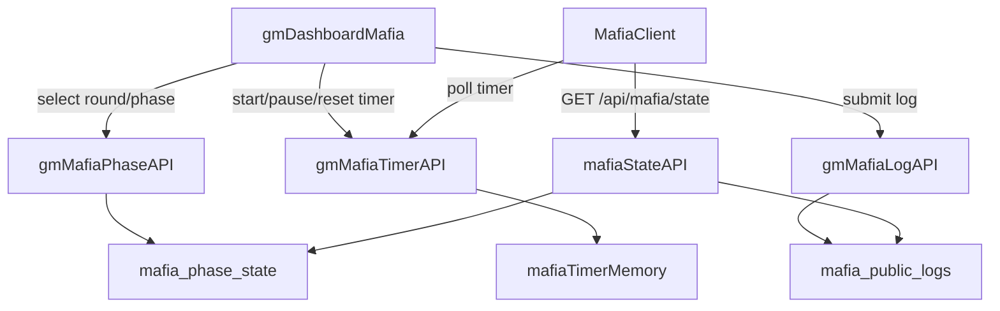

## 마피아 라운드/페이즈/타이머/로그 기능 설계

### 1. 마피아 라운드 설정 (GM 대시보드)

- **대상 파일**: [`app/dashboard/x9a2k7/mafia/page.tsx`](app/dashboard/x9a2k7/mafia/page.tsx), 필요 시 분리된 컴포넌트(`MafiaAdminState`류)가 있다면 함께 수정.
- **라운드 선택 UI 추가**:
  - 상단 제어 영역에 **라운드 선택 드롭다운 또는 버튼 그룹** 추가: `튜토리얼, 1, 2, 3, 4, 5`.
  - 내부 값은 `round_number`로 매핑: 튜토리얼은 `0`, 나머지는 `1~5` 정수.
  - 선택 후 "적용" 버튼을 눌렀을 때, 새로운 **GM용 API**(예: `POST /api/gm/mafia/phase`)로 `round_number`를 업데이트.
- **서버 상태 반영**:
  - 이미 존재하는 `mafia_phase_state`를 이용하므로, `round_number`를 업데이트하는 쿼리를 GM API에서 수행.
  - `GET /api/mafia/state?all=1`에서 내려오는 `phase.round_number`를 GM 대시보드/클라이언트 양쪽에서 공통으로 사용.

### 2. 페이즈 한글 표시 매핑

- **대상 파일**: [`app/mafia/MafiaClient.tsx`](app/mafia/MafiaClient.tsx), [`app/dashboard/x9a2k7/mafia/page.tsx`](app/dashboard/x9a2k7/mafia/page.tsx).
- **phase 라벨 매핑 상수 정의** (공통 유틸 또는 두 곳에 동일하게):
  - `auction -> "직업 경매"`
  - `trade -> "주식 거래"`
  - `apply -> "주가 변동"`
  - `vote -> "투표"`
  - `end -> "라운드 종료"`
  - `prepare -> "라운드 준비"` (신규 추가)
- **클라이언트/대시보드 UI**에서 `phase.phase` 값을 이 매핑으로 변환해 표기.
- `MafiaClient`의 탭 표시/사용 가능 여부 로직에서 `prepare` 페이즈도 고려하도록 보완 (예: 탭 비활성, 안내 문구 등).

### 3. 마피아용 카운트다운 타이머 API (서버)

- **대상 파일**: Subway 타이머 구현 참고: [`app/api/gm/timers/subway/route.ts`](app/api/gm/timers/subway/route.ts).
- **새 API 생성**: `app/api/gm/timers/mafia/route.ts` (GET/POST 지원).
  - **내부 구조**는 subway 타이머와 동일한 in-memory 싱글톤: `targetEpochMs`, `isRunning`, `remainingSeconds`, `serverNow`.
  - `POST` 바디: `{ action: "start" | "pause" | "reset", durationSeconds?: number }` 형태.
  - `GET` 응답: `{ serverNow, remainingSeconds, targetEpochMs, isRunning }`.
- **페이즈별 기본 시간 설정**:
  - 서버 또는 대시보드 코드에 `DEFAULT_DURATION_BY_PHASE` 상수 정의 (예: `prepare: 60, auction: 180, ...` 등).
  - GM이 페이즈를 변경할 때, 해당 상수를 이용해 `start` 요청 시 기본 시간을 전달하도록 설계.

### 4. GM 대시보드 상단 카운트다운 UI (마피아)

- **대상 파일**: [`app/dashboard/x9a2k7/mafia/page.tsx`](app/dashboard/x9a2k7/mafia/page.tsx).
- **Subway와 동일한 패턴 재사용**:
  - Subway 대시보드 상단 타이머 구현(예: `SubwayTimerSection`, `useSubwayAdminState`)을 참고하여, 마피아 전용 타이머 훅 `useMafiaAdminTimer` 생성.
  - `useMafiaAdminTimer`는 `GET /api/gm/timers/mafia`를 주기적으로 폴링하고, `start/pause/reset`을 `POST`로 호출.
- **UI 요소**:
  - **남은 시간(분:초)**를 크게 표시.
  - 현재 **라운드 번호(튜토리얼/1~5)** 와 한글 페이즈 명을 함께 표기 (예: `2라운드 - 주식 거래` 형식).
  - "시작", "일시정지", "리셋" 버튼 제공.
  - Subway와 동일한 비주얼 스타일(폰트 크기/색상/배경)을 사용해 일관성 유지.

### 5. 마피아 클라이언트 페이지 카운트다운 UI

- **대상 파일**: [`app/mafia/MafiaClient.tsx`](app/mafia/MafiaClient.tsx).
- **상단 헤더 영역 확장**:
  - 현재 표시 중인 라운드 (`phase.round_number`)와 페이즈(`phase.phase` → 한글 매핑)를 **대형 텍스트**로 표시.
  - Subway 클라이언트 상단 타이머 UI를 참고해, 동일한 **남은 시간 카운트다운 표시** 추가.
- **타이머 연동**:
  - `GET /api/gm/timers/mafia`를 1~2초 간격으로 폴링하는 훅(예: `useMafiaTimer`) 생성.
  - 서버 응답의 `serverNow`, `targetEpochMs`, `remainingSeconds`를 이용해 Subway와 같은 방식으로 클라이언트 보정(드리프트 방지) 적용.
- **UX 세부 사항**:
  - 타이머가 멈춰 있을 때는 "대기 중" 등의 표시 또는 페이즈만 보여 주기.
  - 라운드/페이즈 텍스트를 마피아 전체 화면에서 가장 눈에 띄게 키우기 (예: `text-2xl~3xl`).

### 6. GM 대시보드 마피아 로그 입력 UI

- **대상 파일**: [`app/dashboard/x9a2k7/mafia/page.tsx`](app/dashboard/x9a2k7/mafia/page.tsx).
- **기능 개요**:
  - "GM 입력 게임 로그" 전용 섹션을 만든다 (memo 페이지와 비슷한 textarea + 버튼).
  - 이 로그는 `mafia_public_logs` 테이블에 insert되어, **모든 플레이어가 클라이언트에서 보는 공개 로그**로 사용.
- **서버 연동**:
  - 새 GM 전용 API `POST /api/gm/mafia/log` 추가 (또는 기존 GM용 mafia API가 있다면 그 안에 포함).
  - 바디: `{ content: string }` (`round_number`를 함께 넣고 싶다면 `{ content, round_number }`).
  - 구현: `mafia_public_logs`에 insert 후, `id`, `content`, `created_at` 반환.
- **클라이언트 표시**:
  - 플레이어 쪽은 이미 `GET /api/mafia/state`의 `logs`를 사용하고 있으므로, 해당 리스트를 `MafiaResultTab` 또는 별도의 "공지/로그" 영역에서 보여주도록 정리.
  - GM 대시보드에서도 최신 로그 목록을 (예: 10개 정도) 함께 표기해, 입력 결과를 바로 확인 가능하게 함.

### 7. 라운드별 상황/분석 섹션과 공개 로그의 분리

- **용어 정리**:
  - **"GM 입력 게임 로그"**: `mafia_public_logs`에 저장되어 모든 플레이어에게 공개되는 텍스트 로그.
  - **"라운드별 상황"**: GM용 상세 분석 화면. 플레이어별 베팅, 직업/능력 사용, 매수·매도 내역, 주가 변동 요소, 투표/집계 등.
- **계획**:
  - 이번 작업에서는 **공개 로그 입력/표시**를 우선 구현.
  - 라운드별 상황은 기존 설계(6-4)에 맞춰 **별도의 섹션/탭**으로 유지하며, 필요 시 이후 단계에서 각 테이블(`mafia_actions`, `mafia_votes`, `mafia_stock_state` 등)을 조합해 조회하는 UI를 추가.

### 8. 타입 및 공통 유틸 정리

- **대상 파일**: [`lib/types.ts`](lib/types.ts).
- `MafiaPhaseState` 타입에 이미 `round_number`, `phase`가 정의되어 있으므로, 새 phase(`prepare`)가 문자열 유니온으로 포함되어 있는지 확인하고 필요시 확장.
- 라운드/페이즈 한글 라벨 매핑을 별도 유틸(예: [`lib/labels/mafia.ts`](lib/labels/mafia.ts))로 분리해, 대시보드/클라이언트가 공통으로 사용하도록 정리.

### 추가 규칙 정리 (라운드/페이즈/능력/주가)

#### A. 현금 초기화 타이밍

- **기본 현금**: 모든 플레이어는 **튜토리얼 라운드 시작 시**와 **1라운드 시작 시**에만 `30원`을 기본으로 갖는다.
- **초기화 시점**:
  - `round_number = 0`(튜토리얼), `phase = "prepare"` 상태에서 `auction`으로 전환할 때
  - `round_number = 1`, `phase = "prepare"` 상태에서 `auction`으로 전환할 때
- **처리 로직**:
  - 위 두 경우에 한해, 각 플레이어의 `mafia_player_state.cash`를

`cash = 30 + subway 1게임 등수 보너스`로 **덮어쓴다**.

- **2라운드 이후(`round_number >= 2`)의 `prepare → auction` 전환에서는 cash를 초기화하지 않는다.**

- **1게임(지하철) 등수 보너스 규칙**:
  - 기본: `n등 보너스 = 10 − (n − 1)` (1등 10원, 2등 9원, 3등 8원…).
  - 탈출 실패자(시간 종료/미탈출)는 “마지막 등수 + 1등”으로 취급.
    - 예: `finished_rank`가 1, 2, 3인 사람만 있고 나머지는 탈출 실패라면

실패자들은 4등으로 취급 → 보너스 = `10 − (4 − 1) = 7원`.

#### B. 페이즈별 타이머 시간

- 마피아용 타이머 기본 시간:
```ts
const DEFAULT_MAFIA_PHASE_SECONDS: Record<MafiaPhase, number | null> = {
  prepare: null, // GM 수동 진행 (타이머 없음)
  auction: 180, // 3분
  trade: 600, // 10분
  apply: null, // GM 수동 진행 (타이머 없음)
  vote: 300, // 5분
  end: null, // GM 수동 진행 (타이머 없음)
};
```

- **GM 대시보드 동작**:
  - `prepare → auction`, `auction → trade`, `apply → vote`처럼 **타이머가 필요한 페이즈**로 넘어갈 때만

해당 기본 시간을 사용해 `start` 액션으로 타이머를 시작한다.

- `prepare`, `apply`, `end` 자체로 진입할 때는 기본적으로 타이머를 새로 시작하지 않거나 정지 상태를 유지한다.
- **클라이언트/대시보드 UI**:
  - Subway와 동일한 스타일의 카운트다운을 사용.
  - `remainingSeconds`가 없거나 `isRunning = false`일 때는 시간 숫자를 숨기고 “준비 중/진행 중” 정도의 텍스트만 표시.

#### C. 페이즈/라운드 전환 제약

- **페이즈 순서 강제**:
  - 허용 순서 예시:

`prepare → auction → trade → apply → vote → end`

- GM UI에서는 **현재 페이즈의 바로 다음 페이즈로 가는 버튼만 활성화**, 나머지는 disabled 처리.
- `advance-phase` API에서도 `fromPhase`, `toPhase`를 검증해, 허용되지 않는 조합이면 4xx 에러로 거절.
- **라운드 전환 제약**:
  - 현재 라운드가 `end` 페이즈에 도달하기 전까지는 라운드 번호(튜토리얼/1~5)를 변경할 수 없다.
  - GM UI에서 라운드 선택 컨트롤은 `phase.phase === "end"`일 때만 활성화.
  - 서버에서도 현재 phase가 `end`가 아니면 라운드 변경 요청을 거절.

#### D. 직업 능력 상세 및 적용 시점

- **공통**: 모든 직업 능력은 기본적으로 `trade → apply` 전환 시점(= `apply` 페이즈 버튼)에서 일괄 처리한다.

- **상승 주가조작범 (마피아)**

  - 국채를 제외한 한 종목의 주가를 `+2` 한다.
  - 대상 종목과 사용 여부는 비공개 (능력 액션은 DB에 기록하되 플레이어 공용 UI에는 노출하지 않음).

- **하락 주가조작범 (마피아)**

  - 국채를 제외한 한 종목의 주가를 `−3` 한다.
  - 최소 주가 **1**을 하한으로 둔다 (1 아래로 내려가지 않음).

- **강도 (마피아)**

  - 자신을 제외한 두 명을 선택.
  - 각 대상의 **이번 라운드 수익**의 절반을 훔친다.
    - 이번 라운드 수익 = `매도 수익 + 직업 능력으로 얻은 수익` (매수 비용은 포함하지 않음).
    - 각 대상에 대해 `훔친 금액 = floor(해당 대상 라운드 수익 / 2)`.
  - 훔친 금액만큼 강도의 `cash`는 증가, 대상의 `cash`는 감소.
  - 강도 피해자의 `cash`는 **음수까지 허용**.
  - 선택한 대상과 금액은 비공개 (GM/로그용으로만 저장).

- **경찰 (시민)**

  - `apply` 단계에서 `+5원`.
  - 한 사람을 조사해 **마피아인지 여부**를 확인할 수 있음 (비공개 정보로만 저장/표시).

- **세무조사원 (시민)**
  - `apply` 단계에서 `+5원`.
  - 자신 제외 한 사람을 선택해 그 사람의:
    - 보유 주식 종류/보유량,
    - 이번 라운드 매수/매도 내역

을 열람할 수 있음 (본인에게만 비공개로 보여줌).

- **증권사 직원 (시민)**

  - 국채를 제외한 종목 하나를 선택.
  - 그 종목의 **총 거래금액**(이번 라운드 매수 금액 + 매도 금액)의 10%를 얻음.
    - `보상 = floor(총 거래금액 * 0.1)`.

- **CEO (시민)**

  - `apply` 단계에서 `+10원`.

- **시장 (시민)**

  - 경제사범으로 뽑혀도 **벌금을 내지 않는다**.
  - 강도의 피해를 받지 않는다 (강도 타깃 선정/효과 계산에서 제외).
  - 해당 라운드의 **표 가격(1~3원)**을 결정할 수 있으며, 이 가격은 그 라운드의 투표 비용에만 적용된다.

- **월급쟁이 (시민)**
  - 직업 경매에서 실패한 플레이어에게 자동 부여 (auction→trade 전환 시 결정).
  - `apply` 단계에서 `+3원`.

#### E. 주가 범위

- **각 종목의 주가 하한**: 최소 `1` (어떤 조작/변동 후에도 1 이하로 내려가지 않음).
- **상한**: 별도 제한 없음 (이론상 무한대).
- 모든 주가 변경 로직(기본 규칙, 직업 능력 등)에서 업데이트 후 `price = max(price, 1)`로 보정.

#### F. 페이즈 전환용 advance-phase API 구조

- **API 폴더 구조**: `app/api/mafia/advance-phase/` 아래에 **페이즈 전환별 파일**을 둔다.
  - 예시:
    - `prepare-to-auction.ts`
    - `auction-to-trade.ts`
    - `trade-to-apply.ts`
    - `apply-to-vote.ts`
    - `vote-to-end.ts`
- **공통 규칙**:
  - 각 파일은 **현재 phase/round를 검증**하고, 허용된 전환이 아니면 4xx 에러를 반환한다.
  - 비즈니스 로직(현금/직업/주가/투표 정산)을 수행한 뒤, `mafia_phase_state`의 `round_number`, `phase`를 업데이트한다.
- **prepare → auction**:
  - `round_number`가 0(튜토리얼) 또는 1인 경우에만:
    - 모든 플레이어의 `mafia_player_state.cash`를 `30 + (지하철 1게임 finished_rank 기반 보너스)`로 초기화.
  - 2라운드 이상에서는 cash를 초기화하지 않고 그대로 유지.
- **auction → trade**:
  - 해당 라운드의 경매 베팅 내역을 모아 **직업별 낙찰자**를 계산.
  - `mafia_player_state.job`에 직업을 할당하고, 실패한 플레이어에게는 `월급쟁이`를 자동 부여.
  - 필요 시 베팅 금액만큼 `cash`를 차감.
- **trade → apply**:
  - 각 종목의 기본 규칙에 따른 주가 변동을 계산한 뒤:
    - 상승/하락 주가조작범의 능력을 반영해 주가를 추가 조정 (최소 1 보장).
  - 이번 라운드 거래 내역과 직업 정보를 이용해:
    - CEO, 증권사 직원, 월급쟁이, 경찰, 세무조사원 등의 **직업 수익**을 `cash`에 반영.
  - 강도의 경우:
    - 선택된 두 대상의 이번 라운드 수익(매도 수익 + 직업 수익)을 기준으로 절반씩 훔쳐 `cash`를 재계산(피해자는 음수 허용, 시장은 대상에서 제외).
- **apply → vote**:
  - 필요 시 시장 직업을 가진 플레이어가 **해당 라운드 표 가격(1~3원)**을 결정할 수 있는 상태를 준비.
  - 투표 시 사용될 표 가격과 라운드 정보를 저장.
- **vote → end**:
  - 라운드별 투표 결과를 합산해 **경제사범**을 결정.
  - 경제사범에게 벌금·국채 등 패널티를 적용하고, 시장 직업 보유자는 벌금 면제/강도 피해 면제 규칙을 반영.
  - 라운드 정산 결과를 `mafia_public_logs` 또는 별도 라운드 로그 테이블에 기록할 수 있도록 여지를 남긴다.

### 9. 동작 흐름 요약 (Mermaid)



이 흐름을 기준으로, Subway에서 이미 검증된 타이머/대시보드 패턴을 최대한 재사용하여 마피아 게임의 라운드·페이즈·카운트다운·공개 로그 기능을 구현합니다.