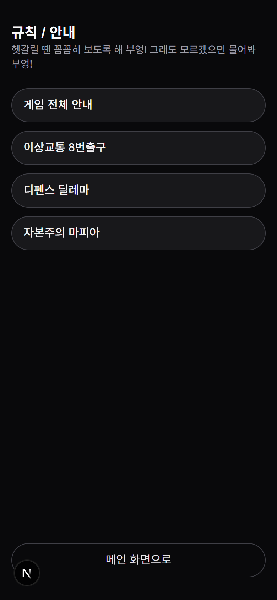
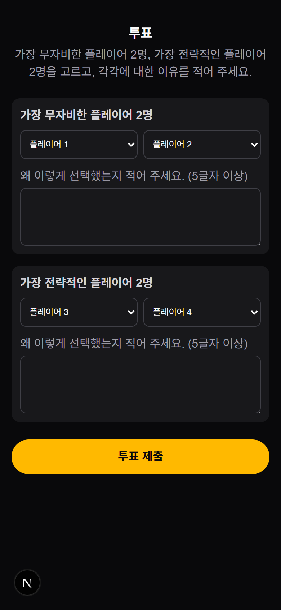

# 🦉 부엉이 게임 — 시즌 0 파일럿 프로그램

> **이 게임에 엑스트라는 없습니다. 모두가 주인공이 되는 두뇌게임 서바이벌!**
>
> 웹 시스템 + 오프라인 공간을 결합한 지니어스형 두뇌게임. 미네르바에게 소환된 플레이어들이 **3개의 메인 게임 + 2개의 히든 피스**를 통해 전략·추리·협력·운을 겨뤄 최종 승자를 가립니다.

---

## 1. 한눈에 보기

| 항목 | 내용 |
| --- | --- |
| 시즌 / 챕터 | 부엉이 게임 / 챕터 0 — **파일럿 프로그램** |
| 포맷 | 지니어스 (두뇌게임 서바이벌) |
| 장르 | 판타지 / 전략 / 추리 |
| 플레이 타임 | 약 5~6시간 (게임별 분리 운영 가능) |
| 인원 | 7~9명 (규칙 조정 시 최대 12명) |
| 세계관 | '가이아' — 신과 필멸자가 공존하는 세계. 지혜의 여신 **미네르바**가 지구인을 소환해 이상현상 해결을 의뢰 |
| 진행 | 게임마스터 **솔리테르**가 진행, 미네르바의 전언으로 스토리 연결 |
| 핵심 장치 | ① 개인 스마트폰 웹페이지 기반 실시간 상호작용 ② 오프라인 공간의 숨겨진 단서 |

**부엉 깃털** = 점수. 매 게임 성적에 따라 배분되며(전체 30개 내외), **양도 불가**. 모든 게임 종료 후 최다 보유자가 우승. 동점 시 1등을 더 많이 한 사람 우선.

---

## 2. 전체 구성

```
인트로(세계관) → 1게임 이상교통 → [히든1] → 2게임 디펜스 딜레마 → [히든2] → 3게임 자본주의 마피아 → 최종 투표·시상
```

- 메인 게임 3개는 **순차 진행**, 히든 피스 2개는 전체에 걸쳐 **병렬 진행**.
- 각 게임 사이 20분 휴식 + 자유 밀담(작당모의·정보교환·뒤통수·엿듣기 모두 허용).
- 모든 게임은 QR/링크로 접속하는 **웹페이지**에서 진행됩니다.

| # | 게임 | 키워드 | 인원 | 시간 | 깃털 배분 |
| --- | --- | --- | --- | --- | --- |
| 1 | **이상교통 8번출구** | 탈출·추리·규칙 발견 | 7~9 | 50분 | 1·2등 2개 / 탈출 1개 / 최속 +1 |
| 2 | **디펜스 딜레마** | 협력·배신·자원관리 | 7~9 | 2시간 | 1등 3 / 2·3등 2 / 4~6등 1 |
| 3 | **자본주의 마피아** | 경제·마피아·심리전 | 7~9 | 2시간 | 1등 4 / 2등 3 / 3등 2 / 4~6등 1 |
| H1 | 히든 피스 1 (주문) | 관찰력·방탈출 | 전원 | 수시 | 최대 2개 |
| H2 | 히든 피스 2 (쪽지시험) | 문해력·세계관 | 전원 | 수시 | 1등 2 / 2·3등 1 |

---

## 3. 인트로 — 세계관 진입

플레이어가 닉네임으로 접속하면 만나는 메인 화면. `game_state`에 따라 메인 버튼(이상교통/디펜스/마피아/투표)이 바뀝니다. 태양 슬라이더와 부엉이 날개에는 **히든 피스 1** 단서가 숨어 있습니다.


> 💡 우상단 **닉네임 변경**, 하단 **규칙/안내 → 이상교통 8번출구**. 메인 버튼은 GM이 현재 게임을 무엇으로 여느냐에 따라 달라집니다.

규칙/안내 페이지에서는 공개된 게임의 룰북만 노출됩니다.



---

## 4. 1게임 — 이상교통 8번출구

> 이상 현상이 발생한 지하철 통로. **0번 출구에서 8번 출구까지** 탈출하는 규칙-발견형 추리 퍼즐. 각 장소에서 **앞으로 / 뒤로**만 선택 — 맞으면 출구 +1, 틀리면 0번으로 리셋. 정답을 정하는 **8개의 숨은 규칙**을 스스로 발견해야 합니다.


### 숨은 규칙과 공개 조건 (핵심)

규칙은 처음엔 보이지 않고, **특정 행동을 하면 하나씩 공개**됩니다. 일부는 웹에서 자동, 일부는 **오프라인 행동 → GM이 수동 공개**합니다.

| 규칙 | 내용 요약 | 공개 조건 | 공개 방식 |
| --- | --- | --- | --- |
| 1 | 한 곳에 10초 이상 머물러라 | 한 장소에 30초 이상 머무름 | 웹 자동 |
| 2 | 문(밀담실)을 열지 마라 → 뒤로 | **밀담실 입장** | 🧍 GM 수동 |
| 3 | 음식이 보이면 뒤로 | **식당에서 간식 챙김** | 🧍 GM 수동 |
| 4 | 수배범을 마주치면 뒤로 | **수배범 신고 성공 처리** | 웹 신고 + GM 승인 |
| 5 | 위화감 없는 현실 장소면 뒤로 | 같은 장소를 3번 마주침 | 웹 자동 |
| 6 | 6번 출구에서는 앞으로 가지 마라 | 6번 도달 후 0번 복귀 | 웹 자동 |
| 7 | 1~6에 없으면 앞으로 (8은 없음) | 규칙 1~6 모두 발견 | 웹 자동 |
| 8 | (함정) 누구도 믿지 마라 — 페널티 없음 | 항상 표시 | — |

### GM 화면 (이상교통)

GM은 타이머, 플레이어별 현재 위치, 그리고 **밀담실/음식 트리거 버튼**(= 규칙 2·3 공개)을 관리합니다.


> 💡 우측 **밀담실 / 음식** 버튼이 곧 규칙 2·3의 "오프라인 행동" 트리거입니다. 플레이어가 실제로 밀담실에 들어가거나 간식을 챙기면 GM이 눌러 규칙을 열어줍니다.

---

## 5. 2게임 — 디펜스 딜레마

> 도시를 습격하는 몬스터 24마리(6종)를 함께 물리치되, **보상은 공격 참여자끼리 균등 분배**되는 협력-배신 딜레마. 숫자 카드(1·2·3·4)를 자원으로 관리하며 매 라운드 **전투 / 휴식 / 훈련** 중 하나를 선택. 누가 무엇을 했는지 **비공개**라 무임승차가 가능합니다.


- 4칸 대기열의 몬스터를 골라 활성 카드를 제출 → 라운드 종료 시 **제출 합 ≥ HP**면 처치, 보상 균등 분배(나머지 버림).
- 잔여시간 0이 된 몬스터는 도망 → **전원 최대 활성 카드 1장 비활성화** 단체 페널티.
- 몬스터 6종: 스컬 스파이더(HP1·+2) … 서브웨이맨(HP15·+21) 보스.

### GM 화면 (디펜스)

라운드 전환(튜토리얼 2R + 본게임 12R), 점수 관리, 전투 결과 중계를 담당합니다.


---

## 6. 3게임 — 자본주의 마피아

> 직업을 **경매**로 낙찰받아 능력을 얻고, **주식**을 사고팔며, **투표**로 경제사범을 색출하는 복합 마피아 게임. 마피아 3종 + 시민 4종의 **비공개 능력**이 주식 시장과 맞물려 정보전·심리전을 만듭니다. 최종 **자산(주식+현금)**으로 순위 결정.


각 라운드 4단계: **① 직업 경매(3분) → ② 주식 거래 + 능력 사용(10분) → ③ 주가 변동 적용 → ④ 경제사범 투표(5분)**. 모든 입력은 비공개, 결과만 공개됩니다. (시작 현금 30원, 4종목 초기가 5원)

### GM 화면 (마피아)

페이즈 전환(경매→거래→주가변동→투표→종료), 플레이어 자산 현황, 주가 중계를 담당합니다.


---

## 7. 최종 투표 & 히든 피스

3게임 종료 후 **가장 무자비한 / 가장 전략적인 플레이어**를 뽑는 마무리 투표를 진행합니다.



- **히든 피스 1 (관찰력)**: 공간의 단서 + 웹의 숨은 요소를 조합해 **주문**을 찾아 GM에게 말하면 성공 (깃털 2개).
- **히든 피스 2 (문해력)**: 공간에 부착된 세계관 자료를 읽고 **5문항 쪽지시험** 응시 (1등 2개 / 2·3등 1개).

---

## 8. 오프라인 공간 & 물리 요소

게임은 웹으로 돌아가지만, **세계관·히든피스·일부 규칙 공개는 오프라인 공간**에서 완성됩니다. (기존 '와쳐' 형식처럼 서랍·소품 사이에 숨기는 방식)

### 공간 구성
- **로비**(메인 진행) · **식당**(간식 — 규칙 3 트리거) · **밀담실 1~2개**(규칙 2 트리거 / 밀담)
- 프로젝터 + 노트북(PPT·BGM·관리·메모 페이지), 충전기·보조배터리, 이름표·메모패드·볼펜·클립보드

### 인쇄·은닉물 (저장소 `artwork/print`, `artwork/rulebook_*`)

| 자산 | 파일 | 현장 배치 |
| --- | --- | --- |
| 공개수배서 | `wanted.pdf` | 게시 → 수배범 신고(비밀 URL)로 연결, 규칙 4 |
| 현실 사진 | `real_1~4.pdf` | "현실 모방" 단서로 부착, 규칙 5 세계관 |
| 부엉이 사진 | `number_owls.pdf` 등 | 히든피스 1 단서 |
| 히든피스 단서 | `hidden_1~2.pdf` | 부착 |
| 히든피스 2 판넬(검은 판) | (별도 제작) | **숨겨두기** — 쪽지시험 자료 |
| 룰북 QR | `rulebook_2nd/*.pdf`, `QR_set.pdf` | 인쇄 시 `/rules`의 룰북으로 연결 |
| 결승 상품 | `achilles_prize.pdf`, `minerva_prize.pdf`, `odysseus_prize.pdf` | 시상식 연출 |

> 📌 종이는 떼지 말고, 검은 판은 가져가지 말 것(찍거나 기억해 활용) — 인트로에서 안내.

---

## 9. 혼자서 테스트 플레이하기 (테스트 콘솔)

사람을 모으지 않고도, **여러 탭을 띄워 플레이어 N명 + GM을 1인 다역**으로 실제 게임을 돌려볼 수 있습니다. 같은 백엔드·DB·규칙을 그대로 쓰므로 진짜 플레이입니다.

> 접속: 배포 주소의 **`/test`**


**사용 순서**
1. **① 게임 시작** — 진행할 게임을 눌러 활성화
2. **② 플레이어 생성** — 단건 또는 일괄(예: 테스터1~6)
3. **③ 플레이어 입장** — 각 버튼이 **새 탭 = 독립 플레이어**로 열림 (`?as=닉네임`, 탭마다 다른 정체성)
4. **④ GM 대시보드** — GM 탭을 따로 띄워 페이즈/라운드 전환
5. **⑤ DB 초기화** — 판을 다시 시작

GM 메인 대시보드에서 게임 전환·규칙 공개·부엉깃털을 관리합니다.


> 💡 **이 방식으로 검증되는 것**: 웹 게임 로직·플로우·페이즈 전환·자산/주가/투표/정산 전부.
> **검증 안 되는 것(본질적)**: 오프라인 물리 단서, GM 구두 판정·연출, N명 동시 입력의 실시간 부하.

자세한 환경설정·초기화 동작·표는 같은 폴더의 **`TEST_CONSOLE.md`** 참고.

---

## 10. 환경 / 배포

- 스택: **Next.js(App Router) + TypeScript + Supabase + Tailwind**. 모든 클라이언트는 `app/api/**`를 통해서만 DB 접근.
- 테스트 배포: `test-console` 브랜치 → Vercel. 환경변수에 `SUPABASE_URL`, `SUPABASE_SERVICE_KEY`, `ENABLE_TEST_CONSOLE=1`, `NEXT_PUBLIC_ENABLE_TEST_CONSOLE=1`.
- **실제 이벤트 배포(`main`)에는 `ENABLE_*`를 넣지 않음** → 파괴적 테스트 API 차단.

---

<sub>이 문서의 화면은 로컬에서 실제 페이지를 캡처한 것입니다. (모바일 뷰 = 플레이어 화면 / 와이드 뷰 = GM 대시보드)</sub>
