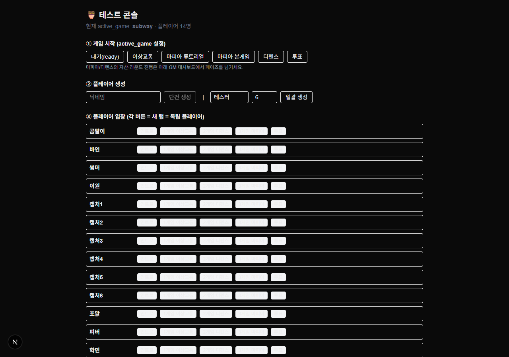
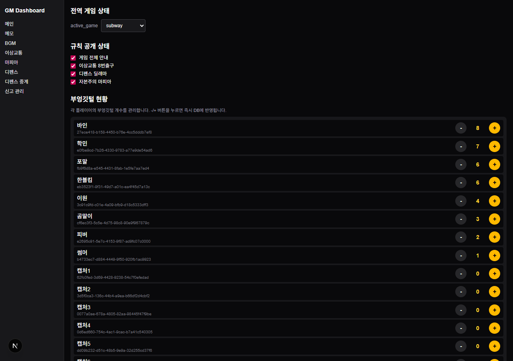
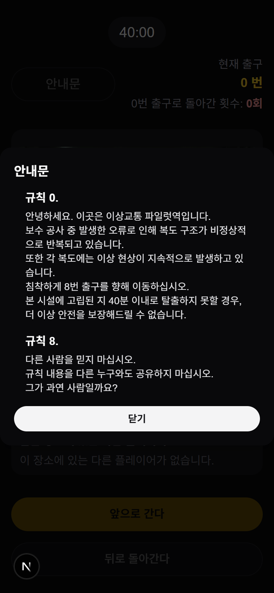
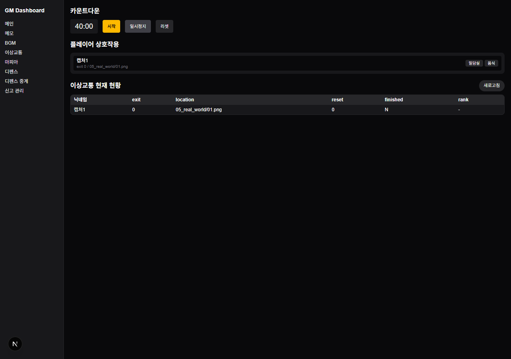
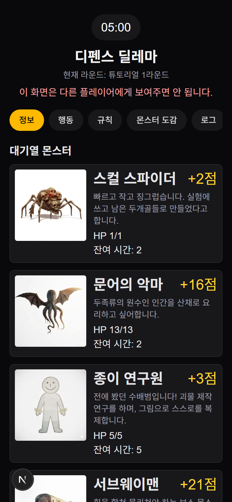
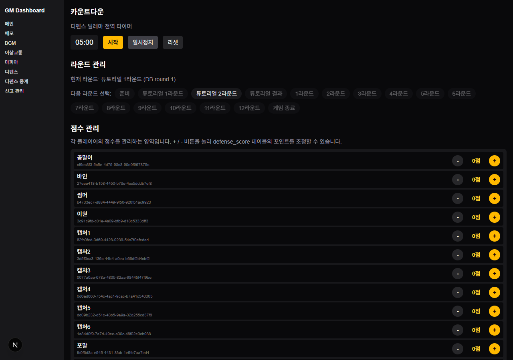
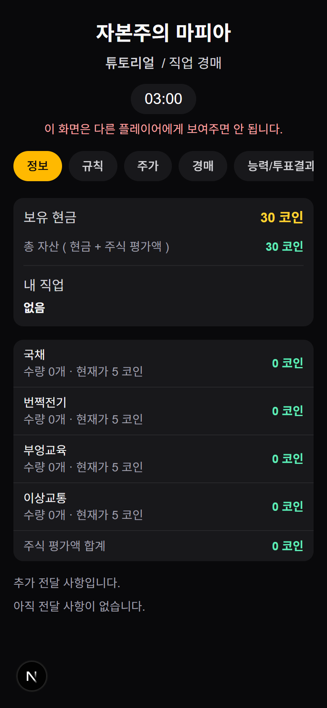
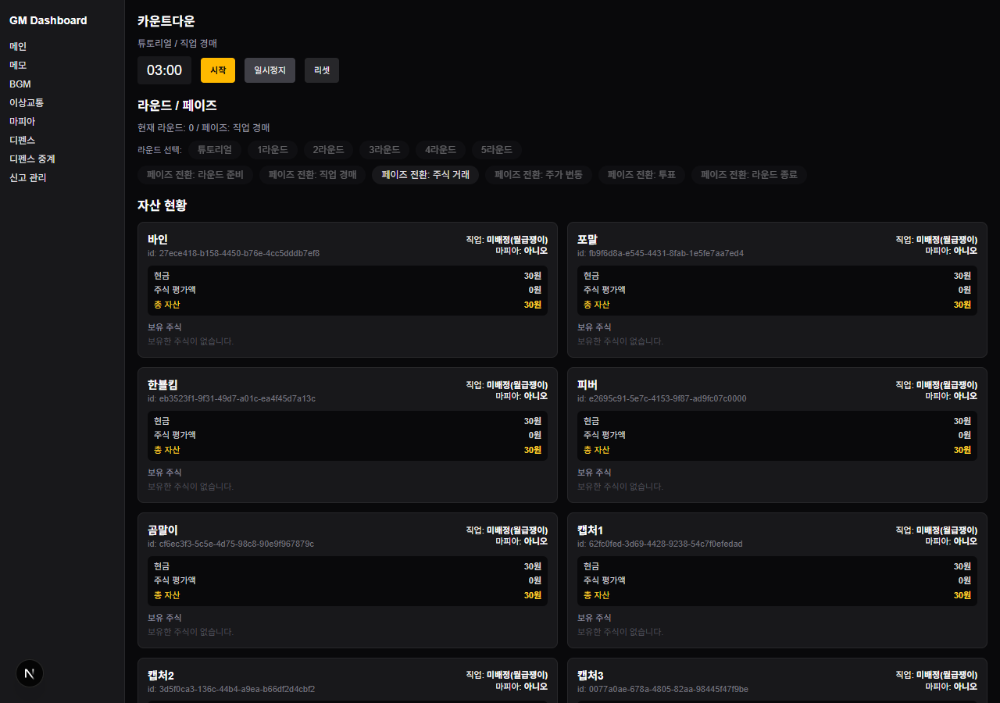

# 🦉 부엉이 게임 — 테스트 플레이 & GM 가이드

사람을 모으지 않고도 **혼자서 여러 탭을 띄워(플레이어 N명 + GM 1명) 1·2·3게임을 실제로 돌려볼 수 있습니다.** 같은 백엔드·DB·규칙을 그대로 쓰므로 진짜 플레이입니다.

---

## 0. 먼저 — 테스트 콘솔 열기

배포 주소의 **`/test`** 로 접속합니다. 여기서 모든 준비를 합니다.

1. **① 게임 시작** — 지금 진행할 게임을 누릅니다(예: `이상교통`). 화면 상단 `active_game`이 바뀝니다.
2. **② 플레이어 생성** — 닉네임을 직접 만들거나, `일괄 생성`으로 `테스터1~6`을 한 번에 만듭니다.
3. **③ 플레이어 입장** — 각 플레이어 줄의 게임 버튼을 누르면 **새 탭**이 열립니다.
   - 💡 **탭 하나 = 플레이어 한 명**입니다. 5명을 테스트하려면 버튼을 눌러 탭 5개를 띄우면, 각 탭이 서로 다른 플레이어가 됩니다.
4. **④ GM 대시보드** — GM 화면을 **별도 탭**으로 띄워두고, 거기서 게임을 진행시킵니다.
5. **⑤ DB 초기화** — 한 판 끝나고 다시 시작할 때 사용합니다(맨 아래 참고).

> 추천 세팅: 화면에 **플레이어 탭 여러 개 + GM 탭 1개**를 나란히 띄워두고, GM 탭에서 진행을 누르며 플레이어 탭들이 어떻게 바뀌는지 확인합니다.

플레이어가 입장하면 보게 되는 첫 화면입니다(닉네임 확인 + 현재 게임 버튼).

---

## 1. GM 메인 대시보드 (모든 게임 공통)

GM 대시보드 첫 화면. 게임 전체의 "스위치판"입니다.

- **전역 게임 상태 (`active_game`)** — 지금 어떤 게임을 여는지 선택합니다. 플레이어 화면은 이 값에 따라 들어갈 수 있는 게임이 정해집니다.
- **규칙 공개 상태** — 게임별 룰북을 플레이어의 `규칙/안내`에 보이게 할지 켜고 끕니다.
- **부엉깃털 현황** — 각 플레이어의 점수를 `+ / -` 로 직접 조정합니다. 매 게임 결과를 여기에 반영합니다.

### GM 대시보드 메뉴 한눈에

| 메뉴 | 역할 |
| --- | --- |
| **메인** | 게임 전환 · 규칙 공개 · 부엉깃털 관리 |
| **이상교통** | 1게임 타이머 · 규칙 공개 트리거 · 플레이어 현황 |
| **디펜스** | 2게임 라운드 전환 · 점수 관리 |
| **디펜스 중계** | 빔 프로젝터용 전투 결과 보드(라운드별) |
| **마피아** | 3게임 페이즈 전환 · 자산 현황 · 주가 |
| **BGM** | 배경음 재생 페이지(프로젝터/스피커용) |
| **메모** | GM 진행 기록용 메모장 |
| **신고 관리** | 수배범 신고 승인/기각(1게임 규칙 4 공개) |

---

## 2. 1게임 — 이상교통 8번출구

장소 이미지를 보고 **앞으로 / 뒤로**만 선택해 0번 → 8번 출구까지 탈출하는 게임입니다. 정답 규칙은 처음엔 숨겨져 있고, 특정 행동을 하면 하나씩 열립니다.

### ▶ 테스트 플레이 (친절 단계)

1. 콘솔에서 **① 이상교통** 누르기 → **② 플레이어 생성** → **③ 입장**(플레이어 탭 열기).
2. 플레이어 탭: 가운데 **장소 이미지**를 보고 아래 **「앞으로 간다」 / 「뒤로 돌아간다」** 중 하나를 누릅니다.
3. 맞으면 **출구 번호 +1**, 틀리면 **0번으로 리셋**. 8번에 도달하면 탈출 완료.
4. 같은 장소에서 10초가 지나기 전에 누르면 무조건 오답 처리됩니다(규칙 1).

### 🎙 GM 역할 — 이상교통 대시보드

- **카운트다운** — `시작 / 일시정지 / 리셋`으로 40분 제한시간을 운영합니다.
- **플레이어 상호작용 (규칙 공개 트리거)** — 플레이어별 **「밀담실」 / 「음식」** 버튼.
  - 플레이어가 실제로 **밀담실에 들어가면 「밀담실」**, **간식을 챙기면 「음식」**을 눌러 줍니다. → 그 플레이어에게 **규칙 2 / 규칙 3**이 공개됩니다.
- **이상교통 현재 현황** — 플레이어별 현재 출구·위치·리셋 횟수·탈출 여부·등수를 표로 봅니다.

> 규칙 공개 요약: 규칙 1·5·6·7은 플레이 중 **자동** 공개, 규칙 2·3은 **위 버튼으로 수동**, 규칙 4는 **신고 관리에서 신고 승인** 시 공개됩니다.

---

## 3. 2게임 — 디펜스 딜레마

몬스터를 함께 물리치되 보상은 참여자끼리 나누는 협력-배신 게임. 숫자 카드(1·2·3·4)를 관리하며 매 라운드 **전투 / 휴식 / 훈련** 중 하나를 고릅니다.

### ▶ 테스트 플레이 (친절 단계)

1. 콘솔에서 **① 디펜스** 누르기 → 플레이어 입장.
2. **GM 디펜스 대시보드에서 라운드를 「준비(0) → 튜토리얼 1라운드」로 올립니다.** 이때 몬스터·카드·점수가 세팅됩니다. (라운드를 올려야 게임이 실제로 시작됩니다.)
3. 플레이어 탭: **대기열 몬스터**를 확인하고 **행동** 탭에서 하나를 선택합니다.
   - **전투**: 몬스터를 골라 활성 카드 1장 제출(제출한 카드는 비활성)
   - **휴식**: 비활성 카드 최대 3장 다시 활성화
   - **훈련**: 활성 카드 1장을 비활성화하고, 아무 카드의 숫자를 영구 +1
4. GM이 다음 라운드로 넘기면 전투가 정산됩니다(제출 합 ≥ HP면 처치, 보상 균등 분배).

### 🎙 GM 역할 — 디펜스 대시보드

- **카운트다운** — 라운드당 5분 타이머(`시작 / 일시정지 / 리셋`).
- **라운드 관리** — 현재 라운드 표시 + **다음 라운드 선택**(준비 → 튜토리얼 1·2 → 튜토 결과 → 본게임 1~12 → 게임 종료). **라운드를 넘길 때마다 전투가 정산되고 새 몬스터가 채워집니다.**
- **점수 관리** — 플레이어별 점수를 `+ / -` 로 조정/확인합니다.
- (빔 프로젝터에는 **디펜스 중계** 메뉴로 라운드별 전투 보드를 띄울 수 있습니다.)

> 진행 순서 = 라운드를 계속 올리는 것입니다. 0(준비) → 1·2(튜토리얼) → 3(튜토 결과) → 4~15(본게임 1~12) → 16(종료).

---

## 4. 3게임 — 자본주의 마피아

직업을 경매로 얻고, 주식을 사고팔고, 투표로 경제사범을 뽑는 복합 게임. **각 라운드가 4단계**로 진행되며, **GM이 단계를 넘겨야** 다음으로 진행됩니다.

### ▶ 테스트 플레이 (친절 단계)

1. 콘솔에서 **① 마피아 본게임**(또는 튜토리얼) 누르기 → 플레이어 입장.
2. **GM 마피아 대시보드에서 페이즈를 순서대로 넘깁니다:**
   `라운드 준비 → 직업 경매 → 주식 거래 → 주가 변동 → 투표 → 라운드 종료` → 다음 라운드 반복.
3. 플레이어 탭에서 각 단계에 맞는 탭이 열립니다:
   - **직업 경매**: `경매` 탭에서 원하는 직업에 베팅 금액 입력
   - **주식 거래**: `거래` 탭에서 종목·수량 매수/매도, `능력사용` 탭에서 직업 능력 사용
   - **투표**: `투표` 탭에서 경제사범 대상에 표 구매
4. GM이 **주가 변동 / 라운드 종료**로 넘기면 매매·능력·투표 결과가 정산되어 자산·주가에 반영됩니다.

### 🎙 GM 역할 — 마피아 대시보드

- **카운트다운** — 단계별 타이머(경매 3분·거래 10분·투표 5분 등). 특정 전환 시 자동 리셋됩니다.
- **라운드 / 페이즈** — 현재 라운드·페이즈 표시 + **페이즈 전환 버튼**으로 게임을 한 단계씩 진행합니다. **이 버튼을 누르는 순간 해당 단계의 정산(자산·주가)이 일어납니다.**
- **자산 현황** — 플레이어별 현금·보유 주식·총자산·마피아 여부를 카드로 확인합니다.
- **주가 / 라운드 로그** — 종목별 현재가와 공개 로그를 관리·중계합니다.

> 핵심: 마피아는 GM이 **페이즈를 넘겨야** 굴러갑니다. 플레이어가 입력만 하고 GM이 안 넘기면 멈춰 있는 게 정상입니다.

---

## 5. 다시 하기 — DB 초기화

콘솔 맨 아래 **⑤ DB 초기화**에서 판을 다시 시작합니다.

- **게임만 초기화** (`이상교통`/`디펜스`/`마피아`) — 그 게임 기록만 지우고 처음 상태로. **플레이어는 유지.**
- **전체 런타임 초기화** — 모든 게임 기록을 지우되 **플레이어는 유지**(같은 인원으로 다시).
- **⚠ 전체 초기화 (플레이어 포함)** — 플레이어까지 전부 지우고 완전 초기 상태로.

> 설정값(현재 게임·라운드·규칙·주가·몬스터 수)은 삭제되지 않고 **초기값으로 복원**되므로, 초기화 후 곧바로 다시 시작할 수 있습니다.
